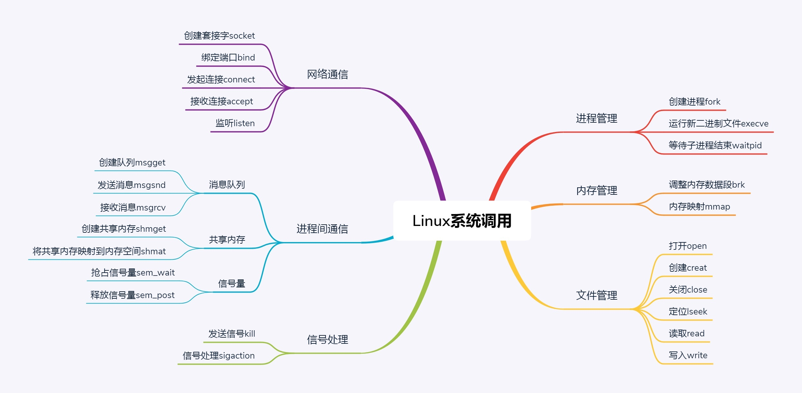

### 1 Linux运行程序的三种方式

https://time.geekbang.org/column/article/88761

#### 1) 在shell里运行

这样执行的程序可能需要和用户进行交互，例如允许让用户输入，然后输出结果也打印到交互命令行上。

这种方式比较适合运行一些简单的命令，例如通过 date 获取当前时间。

这种模式的缺点是，一旦当前的交互命令行退出，程序就停止运行了。这样显然不能用来运行那些需要“永远“在线的程序。比如说，运行一个博客程序，我总不能老是开着交互命令行，博客才可以提供服务。

一旦我要去睡觉了，关了命令行，我的博客别人就不能访问了，这样肯定是不行的。


#### 2 )后台运行

这个时候，我们往往使用nohup命令。这个命令的意思是 ` no hang up（不挂起）`，也就是说，当前交互命令行退出的时候，程序还要在。

当然这个时候，程序不能霸占交互命令行，而是应该在后台运行。

最后加一个 &，就表示后台运行。

另外一个要处理的就是输出，原来什么都打印在交互命令行里，现在在后台运行了，输出到哪里呢？输出到文件是最好的。最终命令的一般形式为```nohup command >out.file 2>&1 &```。

这里面，“1”表示文件描述符 1，表示标准输出，“2”表示文件描述符 2，意思是标准错误输出，“2>&1”表示标准输出和错误输出合并了。合并到哪里去呢？到 out.file 里。

**那这个进程如何关闭呢？我们假设启动的程序包含某个关键字，那就可以使用下面的命令。**

```
ps -ef |grep 关键字 |awk '{print $2}'|xargs kill -9
```

从这个命令中，我们多少能看出 shell 的灵活性和精巧组合。

其中``` ps -ef``` 可以单独执行，列出所有正在运行的程序，grep 上面我们介绍过了，通过关键字找到咱们刚才启动的程序。

```awk ```工具可以很灵活地对文本进行处理，这里的 ```awk '{print $2}'```是指第二列的内容，是运行的程序 ID。

我们可以通过` xargs` 传递给 `kill -9`，也就是发给这个运行的程序一个信号，让它关闭。

如果你已经知道运行的程序 ID，可以直接使用 kill 关闭运行的程序。

在 Windows 里面还有一种程序，称为服务。这是系统启动的时候就在的，我们可以通过控制面板的服务管理启动和关闭它。


#### 3 )以服务的方式运行

例如常用的数据库 MySQL，就可以使用这种方式运行。

**例如在 Ubuntu 中**，我们可以通过 `apt-get install mysql-server` 的方式安装 MySQL，然后通过命令`systemctl start mysql`启动 MySQL，通过`systemctl enable mysql`设置**开机启动**。之所以成为服务并且能够开机启动，是因为在 /lib/systemd/system 目录下会创建一个 XXX.service 的配置文件，里面定义了如何启动、如何关闭。

在 CentOS 里有些特殊，MySQL 被 Oracle 收购后，因为担心授权问题，改为使用 MariaDB，它是 MySQL 的一个分支。

通过命令yum install mariadb-server mariadb进行安装，命令systemctl start mariadb启动，命令systemctl enable mariadb设置开机启动。同理，会在 /usr/lib/systemd/system 目录下，创建一个 XXX.service 的配置文件，从而成为一个服务。systemd 的机制十分复杂，这里咱们不讨论。如果有兴趣，你可以自己查看相关文档。


### 2 Linux系统调用

#### 1）进程管理

https://techlog.cn/article/list/10182330#f

https://time.geekbang.org/column/article/89251



##### a）创建进程的总结：

**`fork()`函数**参考APUE 182页！！！！

 1、Linux中父进程调用fork创建子进程。 

2、父进程调用fork时，子进程拷贝所有父进程的数据接口和代码过来。

 3、当前进程是子进程，fork返回0；当前进程是父进程，fork返回子进程进程号

 4、如果返回0，说明当前进程是子进程，子进程请求execve系统调用，执行另一个程序。

 5、如果返回子进程号，说明当前进程是父进程，按照原父进程原计划执行。 

6、父进程要对子进程负责，调用waitpid将子进程进程号作为参数，父进程就能知道子进程运行完了没有，成功与否。

 7、操作系统启动的时候先创建了一个所有用户进程的“祖宗进程”，课时1，第3题A选项：0号进程是所有用户态进程的祖先

创建进程的系统调用：fork 

执行另一个程序的系统调用：execve

将子进程的进程号作为参数传给它，父进程就能知道子进程运行完了没有，成功与否：waitpid


#### 2）内存管理

在操作系统中，每个**进程**都有自己的内存，互相之间不干扰，有独立的**进程内存空间**。


> 那独立的办公空间里面，都放些什么呢？项目执行计划书肯定是要放进去的，因为执行过程中肯定要不断地看。
>
> 对于进程的内存空间来讲，**放程序代码的这部分，我们称为代码段（Code Segment）**。


> 项目执行的过程中，会产生一些架构图、流程图，这些也放在会议室里面。有的画在白板上，讨论完了，进入下个主题就会擦了；
>
> 有的画在纸和本子上，讨论的时候翻出来，不讨论的时候堆在那里，会保留比较长的一段时间，除非指明的确不需要了才会去销毁。
>
> 对于进程的内存空间来讲，**放进程运行中产生数据的这部分，我们称为数据段（Data Segment）。**
>
> > 其中局部变量的部分，在当前函数执行的时候起作用，当进入另一个函数时，这个变量就释放了；也有动态分配的，会较长时间保存，指明才销毁的，这部分称为堆（Heap）。


一个进程的内存空间是很大的，32 位的是 4G，64 位的就更大了，我们不可能有这么多物理内存。就像一个公司的会议室是有限的，作为老板，你不可能事先都给项目组分配好。哪有这么多会议室啊，一定是需要的时候再分配。所以，进程自己不用的部分就不用管，**只有进程要去使用部分内存的时候，才会使用内存管理的系统调用来登记**，说自己马上就要用了，希望分配一部分内存给它，但是这还不代表真的就对应到了物理内存。

只有真的写入数据的时候，发现没有对应物理内存，才会触发一个中断，现分配物理内存。

这里我们介绍两个在堆里面分配内存的系统调用，`brk`和`mmap`。

当分配的内存数量比较小的时候，使用 brk，会和原来的堆的数据连在一起，这就像多分配两三个工位，在原来的区域旁边搬两把椅子就行了。当分配的内存数量比较大的时候，使用 mmap，会重新划分一块区域，也就是说，当办公空间需要太多的时候，索性来个一整块。